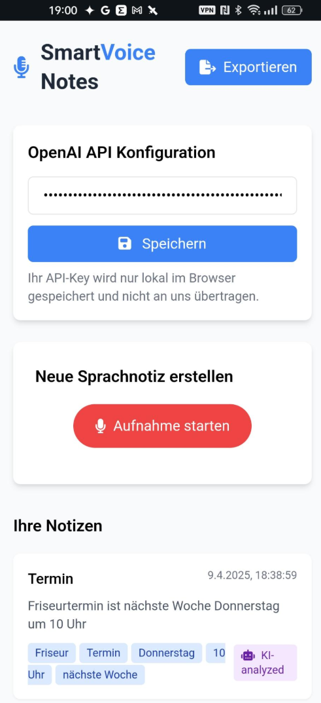

#  SmartVoice Notes - KI-gestützte Sprachnotizen

 

SmartVoice Notes ist eine Webanwendung zur Erstellung und Analyse von Sprachnotizen mit Hilfe von KI. Die App nutzt die Web Speech API für die Spracherkennung und OpenAI für die KI-Analyse der Notizen.

## Features

- 🎤 Sprachnotizen aufnehmen und als Text transkribieren
- 🤖 KI-Analyse von Notizen (Kategorisierung, Schlüsselwörter, Zusammenfassung)
- 💾 Lokale Speicherung aller Notizen im Browser
- 🔐 Sichere Speicherung des OpenAI API-Keys (nur lokal)
- 📥 Export aller Notizen als JSON-Datei
- 📱 Responsive Design für mobile und Desktop-Nutzung

## Technologien

- HTML5, CSS3, JavaScript
- [Tailwind CSS](https://tailwindcss.com/) für das Styling
- [Font Awesome](https://fontawesome.com/) für Icons
- Web Speech API für Spracherkennung
- OpenAI API für KI-Analyse

## Installation & Nutzung

1. Die Anwendung benötigt keine Installation - einfach die `index.html` in einem modernen Browser öffnen
2. Für die KI-Funktionen:
   - OpenAI API-Key in den Einstellungen eingeben
   - Der Key wird nur lokal im Browser gespeichert
3. Aufnahme starten und Notizen erstellen

**Empfohlene Browser:** Chrome oder Edge (beste Unterstützung für Web Speech API)

## Entwicklung

1. Repository klonen:
   ```bash
   git clone https://github.com/ihr-benutzername/smartvoice-notes.git
   ```
2. Die Anwendung ist clientseitig und benötigt keinen Server
3. Für lokale Tests einfach die `index.html` öffnen

## Lizenz

MIT License - siehe [LICENSE](LICENSE) Datei für Details

## Kontakt

Bei Fragen oder Anregungen kontaktieren Sie bitte den Projektbetreuer.
